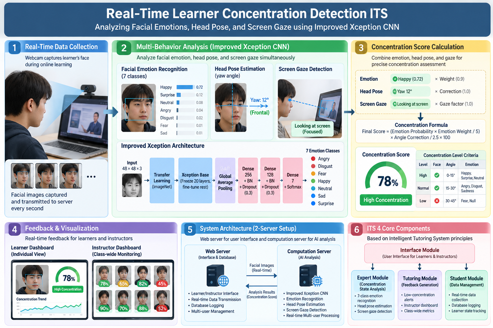

# Real-Time Learner Concentration Detection ITS 2025

[](https://www.python.org/downloads/)
[](https://tensorflow.org)
[](https://keras.io)
[](https://doi.org/10.32431/kace.2025.28.1.002)

---

## 📌 Project Overview

An **Intelligent Tutoring System (ITS)** that detects real-time learner concentration by analyzing **facial emotions, head pose, and screen gaze** using improved Xception CNN. 
This research addresses the limitation of prior work that simply mapped facial emotions to concentration levels, proposing a more comprehensive approach combining multiple behavioral indicators for precise concentration assessment.



## 🔗 Links & Resources
- 📄 **Original Paper**: [KACE Journal Link](https://journal.kace.re.kr/xml/43892/43892.pdf)
- 📊 **Korean Dataset**: [AIHub](https://aihub.or.kr/)
- 🧠 **Xception Architecture**: [Link](https://arxiv.org/abs/1610.02357)- 
- 📈 **Model Comparison Results**: [IJASEIT Link](https://ijaseit.insightsociety.org/index.php/ijaseit/article/view/18078)
---


### 🎯 Key Achievements

| Aspect | Result |
|--------|--------|
| **Model Accuracy** | KFE Dataset **32.8%**, FER2013 **61.9%** |
| **System Architecture** | 2-Server Setup (Web + Computation Server) |
| **Real-Time Processing** | Multi-user simultaneous handling |
| **Usability Evaluation** | Interface 3.58/5.0, Learning Support 3.82/5.0 |

---

## 🔬 Technical Background

### Intelligent Tutoring System (ITS) - 4 Core Components

The system is structured based on ITS principles with 4 functional modules:

```
┌─────────────────────────────────────────────────────────────┐
│                    Interface Module                          │
│      (User Interface for Learners & Instructors)            │
├─────────────────────────────────────────────────────────────┤
│  Expert Module      │  Tutoring Module    │  Student Module │
│  (State Analysis)   │  (Feedback)         │  (Data Mgmt)   │
└─────────────────────────────────────────────────────────────┘
```

#### 1. **Expert Module**: Concentration State Analysis

- 7-class facial emotion recognition
- Head pose/yaw angle estimation
- Screen gaze detection

#### 2. **Student Module**: Real-Time Data Collection

- Webcam-based facial image capture
- Second-by-second server transmission
- Database logging

#### 3. **Tutoring Module**: Feedback Generation

- Automated low-concentration alerts
- Instructor dashboard with class-wide metrics

#### 4. **Interface Module**: Bidirectional Communication

- **Learner Dashboard**: Individual concentration visualization
- **Instructor Dashboard**: Real-time monitoring of all students

---

## 🧠 Deep Learning Model: Improved Xception

### Addressing Data Bias in East Asian Faces

**Problem Identified:**

- FER2013 (Western faces): 60.4% accuracy
- Applied to East Asian faces: **26.4%** (severe degradation)
- Root cause: Dataset bias from Western-centric training data

**Solution Implemented:**

- Multi-dataset training combining Western + East Asian + Japanese data
- CNN model improvement via Xception architecture

```python
# Datasets Used
Training Data = {
    "FER2013": Western facial expressions,
    "KFE": Korean emotional faces (AIHub),
    "JAFFE": Japanese facial expressions
}
```

### Model Selection & Comparison

| Model | FER2013 | KFE (Korean) | JAFFE | Selected |
|-------|---------|------|-------|----------|
| **Xception** | **61.9%** | **32.8%** | **31.5%** | ✅ BEST |
| VGG16 | 62.7% | 23.5% | 29.1% | |
| DenseNet121 | 52.9% | 25.3% | 37.6% | |
| ResNet50 V2 | 49.2% | 19.4% | 22.5% | |

**Why Xception?**

- Improved Inception architecture
- Uses **Depthwise Separable Convolution**
- More efficient feature extraction
- Superior performance on Korean faces

### Network Architecture

```
Input (48×48×3)
    ↓
[Transfer Learning] ImageNet Pre-trained Weights
    ↓
[Xception Base] (Freeze first 20 layers, fine-tune rest)
    ↓
[Global Average Pooling]
    ↓
[Dense 256] + BatchNorm + Dropout(0.3)
    ↓
[Dense 128] + BatchNorm + Dropout(0.3)
    ↓
[Dense 7] + Softmax
    ↓
Output: 7 Emotion Classes
├─ Angry
├─ Disgust
├─ Fear
├─ Happy
├─ Neutral
├─ Sad
└─ Surprise
```

### Training Configuration

```yaml
Batch Size: 64
Epochs: 30
Learning Rate: 0.00001
Optimizer: Adam
Loss: Categorical Crossentropy
Class Weighting: Enabled (handle imbalance)

Data Augmentation:
  Rotation: 0-20 degrees
  Zoom: 0.3x scale
  Horizontal Flip: Yes
  Shear: 0.3
```

---

## 📊 Concentration Score Calculation

### Operational Definition

Learner concentration/non-concentration classification based on:

| Concentration Level | Face Detected | Face Angle | Emotion |
|-------------------|---|-----------|---------|
| **High** | ✅ Yes | Frontal (0-15°) | Happy, Surprise, Neutral |
| **Normal** | ✅ Yes | Partial (15-30°) | Anger, Disgust, Sadness |
| **Low** | ❌ No | Side (30-45°) | Fear, Null |

### Concentration Formula

```
Final Score = (Emotion Probability × Emotion Weight / 5) × Angle Correction / 2.5 × 100
```

#### Step 1: Emotion Weights

```python
Emotion_Weights = {
    "happy": 0.9,       # Positive → High concentration
    "surprise": 0.8,
    "neutral": 0.7,
    "angry": 0.3,       # Negative → Low concentration
    "sad": 0.2,
    "fear": 0.1,
    "disgust": 0.2
}
```

#### Step 2: Angle Correction (Yaw)

```python
if |yaw| ≤ 0°:
    correction = 1.0           # Frontal (maximum)
elif |yaw| < 15°:
    correction = 1.0
elif |yaw| < 25°:
    correction = 0.1 + (25 - |yaw|) / 25 × 0.9   # Linear decay
else:
    correction = 0.1           # Side view (minimum)
```

#### Step 3: Example Calculation

```
Scenario 1: Student with happy expression, facing forward
├─ Emotion Probability: 0.97 (97%)
├─ Emotion: happy → Weight 0.9
├─ Yaw Angle: 5° → Correction 1.0
└─ Score = (0.97 × 0.9 / 5) × 1.0 / 2.5 × 100 = 69.84

Scenario 2: Student writing notes with head down
├─ Emotion Probability: 0.65
├─ Emotion: neutral → Weight 0.7
├─ Yaw Angle: 40° → Correction 0.1
└─ Score = (0.65 × 0.7 / 5) × 0.1 / 2.5 × 100 = 3.64
```

---

## 🏗️ System Architecture

### Hardware & Software Stack

#### Web Server (Front-End)

```yaml
Hardware:
  CPU: Intel i9-7900X
  Memory: 16GB
  Network: 20Mbps
  OS: Linux CentOS 8

Software:
  Runtime: Java (responsive, scalable)
  Framework: Spring Boot (API optimized)
  Web Server: Tomcat
  Database: MySQL
  IDE: Eclipse
```

**Responsibilities:**

- User interface for learners & instructors
- Forward images to computation server via API
- Store results in database
- Real-time dashboard updates

#### Computation Server (Back-End)

```yaml
Hardware:
  CPU: i7-12700
  Memory: 32GB
  GPU: RTX 2080Ti
  Network: 500Mbps

Software:
  OS: Windows 10
  Language: Python 3.8+
  DL Framework: TensorFlow/Keras
  API: Univecon API
```

**Responsibilities:**

- Receive images from web server
- Run CNN inference on GPU
- Return emotion classification results
- Real-time processing

### System Workflow

```
1. Learner accesses web browser
   ↓
2. Webcam captures facial images in real-time
   ↓
3. Images sent to web server
   ↓
4. Web server transmits images to computation server (API)
   ↓
5. Computation server (GPU) runs CNN inference
   ├─ Xception classifies 7 emotions
   ├─ Face detection extracts yaw angle
   └─ Confidence scores calculated
   ↓
6. Results returned to web server
   ↓
7. Web server calculates concentration score
   ↓
8. Data stored in database (second-by-second)
   ↓
9. Real-time dashboard displays results
   ├─ Learner: Individual concentration graph
   └─ Instructor: Class-wide concentration heatmap
```

---

## 📈 Experimental Results & Evaluation

### Study Participants (N=20)

```
Demographics:
├─ Gender: Male 9, Female 11
├─ Education: University students
├─ Year: 1st-4th grade
└─ Age: 20-25 years
```

### Usability Evaluation Results

5-point Likert scale (Cronbach's α = 0.834 → Reliable)

#### Interface Evaluation (Mean: 3.58/5.0)

| Item | Score | Interpretation |
|------|-------|-----------------|
| Easy to find needed functions | 3.8 | ⭐⭐⭐⭐ Excellent |
| System information easily understood | 3.7 | ⭐⭐⭐ Good |
| Intuitive and user-friendly | 3.65 | ⭐⭐⭐ Good |
| Fast and smooth response time | 3.1 | ⭐⭐ Needs Improvement |

**Interpretation:** UI is intuitive, but **response time optimization needed**

#### Learning Support Evaluation (Mean: 3.82/5.0)

| Item | Score | Interpretation |
|------|-------|-----------------|
| Learning motivation improved | 3.9 | ⭐⭐⭐⭐ Effective |
| System helps learning | 3.7 | ⭐⭐⭐ Good |

**Interpretation:** **Positive learning support effect** overall (SD=1.17 shows individual differences)

#### System Stability Evaluation (Mean: 2.61/5.0) ⚠️

| Item | Score | Interpretation |
|------|-------|-----------------|
| System operates stably | 2.75 | ⚠️ Needs Improvement |
| Minimal errors | 2.35 | ⚠️ Critical Improvement Needed |

**Issue Identified:**

- 20 simultaneous video streams cause server load to increase exponentially (n²)
- Network bottleneck when processing increases
- Temporary system unavailability during peak load

### Student Interview Feedback

#### 💬 Positive Feedback

> "From a teacher's perspective, this would be very useful when managing multiple students simultaneously. From a student's perspective, self-reflection enables continuous improvement." - Student L

> "Being able to easily check learner concentration is positive. If applied to actual education, it could create a more controlled learning environment." - Student D

> "Being able to review my own behavior after class and reflect on my learning was satisfying." - Student R

#### ⚠️ Critical Feedback

> "Accuracy seems low." - Student M

> "Calculating concentration based solely on screen time could be unfair to students who actively take notes." - Student B

> "The system became inaccessible when too many users accessed it simultaneously." - Student S

---

## 🔍 Limitations & Future Directions

### Current System Limitations

#### 1. Difficulty Distinguishing Contextual Actions

System cannot discern **intent** behind identical behaviors:

```
Problem Cases:
├─ Head down for note-taking (focused) → Detected as low concentration
├─ Head down due to distraction (unfocused) → Identical detection
└─ Blank neutral expression (focused? unfocused?)
```

**Improvement Strategy:**

- Collect contextual behavioral data
- Implement action intent classification
- Refine operational definitions

#### 2. Scalability Issues in Real-Time System

```
Problem: 20 simultaneous users already cause bottlenecks

Root Causes:
├─ Computation: 20 images × CNN inference = 20 GPU processes
├─ Transmission: Results sent back to each user = n² network load
└─ Cumulative: Exponential growth with user count

Solutions:
├─ Advanced network architecture
├─ Max simultaneous user limits
├─ Load balancing & caching
└─ GPU cluster or distributed processing
```

### Future Research Directions

#### 🔮 Short-Term (6 months)

**1. Behavioral Context Analysis**

- Multi-camera angles for action recognition
- Biometric signals: Heart rate, eye tracking
- ML-based contextual labeling

**2. Performance Optimization**

- Auto-failover mechanisms
- Microservices architecture
- Intelligent caching

#### 📊 Medium-Term (1 year)

**1. Large-Scale Testing**

- Massive open online courses (100+ users)
- Discussion-based seminars
- Real classroom deployment

**2. Enhanced Feedback Features**

- Beyond concentration metrics: Learning strategy suggestions
- Example: "Concentration dropped → 5-min break recommended"
- Personalized learning recommendations

#### 🚀 Long-Term (2+ years)

**1. Multi-Modal Sensor Integration**

- EEG (electroencephalography)
- Eye tracking
- Voice analysis
- Comprehensive learning state assessment

**2. Adaptive ITS Evolution**

- Learn individual concentration patterns
- Auto-adjust content difficulty
- Full AI tutoring system

---

## 💡 Key Contributions
### 1. Practical Research for Educational Implementation
```
Before: Facial emotion = Concentration (oversimplified)
Now: Emotion + Angle + Screen Gaze = Precise concentration
```
### 2. East Asian Data Bias Resolution
```
Standard Model (Western data only):
FER2013 → 60.4% accuracy
Applied to Asians → 26.4% (FAIL)

Improved Model (Multi-dataset):
FER2013 + KFE + JAFFE → 32.8% on Korean faces ✅
```
### 3. End-to-End ITS Implementation
Single research project → Complete system (servers + DB + UI)
### 4. Evidence-Based Validation
Student usability testing (N=20) with qualitative interviews
---

## 🛠 Technology Stack

### Deep Learning & Computer Vision
```
TensorFlow 2.x + Keras
CNN: Xception (Inception improvement)
Transfer Learning: ImageNet pre-trained weights
OpenCV: Face detection & landmark extraction
MediaPipe: Real-time facial keypoints (optional)
```
### Backend & Inference
```
Python 3.8+
Flask/FastAPI for API server
GPU inference server (NVIDIA CUDA)
MySQL for data persistence
```
### Frontend
```
Java Spring Boot + Tomcat
Responsive web interface
WebSocket for real-time updates
Dashboard visualization
```
### Datasets
```
FER2013: 35,887 images (Western faces)
KFE: Korean emotional face dataset (AIHub)
JAFFE: Japanese facial expressions
```

---

## 📚 Related Work & References
### Foundational Research

| Paper | Year | Contribution |
|-------|------|-------------|
| Sharma et al. (2023) | 2023 | Emotion + gaze + head movement combination |
| Bhardwaj et al. (2021) | 2021 | Facial emotion for learning ability monitoring |
| Cha & Kim (2015) | 2015 | Facial landmark-based concentration analysis |

### Key Resources

- **FER2013 Dataset**: [Kaggle FER2013](https://www.kaggle.com/datasets/deadskull7/fer2013)
- **Korean Dataset**: [AIHub](https://aihub.or.kr/)
- **Xception Paper**: [Chollet, F. (2016)](https://arxiv.org/abs/1610.02357)
---

## 📖 Citation

### BibTeX

```bibtex
@article{Lee2025ITS,
  title={Development and usability evaluation of ITS related to real-time learner concentration status using deep learning facial emotion recognition technology},
  author={Lee, Jun-Hyeong and Song, Ki-Sang},
  journal={Journal of Korean Association of Computer Education},
  volume={28},
  number={1},
  pages={13--21},
  year={2025},
  doi={10.32431/kace.2025.28.1.002}
}
```

### APA Format

Lee, J. H., & Song, K. S. (2025). Development and usability evaluation of ITS related to real-time learner concentration status using deep learning facial emotion recognition technology. *Journal of Korean Association of Computer Education*, 28(1), 13-21. https://doi.org/10.32431/kace.2025.28.1.002

---


## 📞 Contact

**Jun-Hyeong Lee** (이준형)

- Affiliation: Korea National University of Education, Ph.d Computer Education
- Email: yjhboky@gmail.com
- GitHub: [@ljh77](https://github.com/ljh77)

---

**⭐ If this project helped you, please consider giving it a star!**

Built with ❤️ for AI-Enhanced Education

</div>
